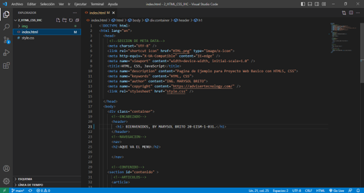
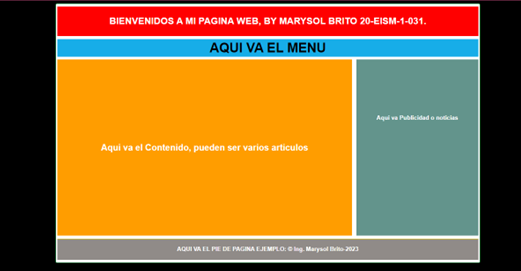

# PTC2_HTML_YCSS_ESTRUCTURA_BASIC
CREACION DE PROTOTIPO DE PAGINA WEB UTILIZANDO PTC2_HTML_YCSS_ESTRUCTURA_BASIC

##capturas de pantalla:

##capturas de pantalla:

## visitar URL: https://marysol-b02.github.io/PTC2_HTML_YCSS_ESTRUCTURA_BASIC/ 
